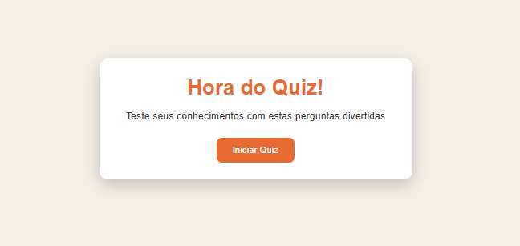

# Quiz Game Simples

Jogo de perguntas e respostas para testar conhecimentos e praticar lógica de programação.

## Sobre
Aplicação web interativa que apresenta questões de múltipla escolha e calcula a pontuação final do usuário. Projeto focado no uso de Arrays e Objetos em JavaScript, manipulação dinâmica do DOM para alternar perguntas e aplicação de lógica para validação de respostas.

### Imagens do projeto:

### Demo
Acesse a demo ao vivo aqui: [Link para Demo](https://quiz-game-simples.vercel.app)

## Tecnologias
- HTML5
- CSS3 
- JavaScript

## Como Usar
Opção 1 — Abrir diretamente
- Baixe/clones este repositório.
- Abra o arquivo index.html no navegador.

Opção 2 — VS Code (Live Server)
- Instale a extensão Live Server
- Clique em  Go Live dentro do index.html

## Estrutura
- index.html: marcação das telas de início, quiz e resultados
- styles.css: estilos visuais e layout das caixas de perguntas
- script.js: lógica do jogo, banco de perguntas e manipulação do DOM

## Scripts
Este projeto não possui package.json nem scripts de npm/yarn; é um app estático e pode ser executado diretamente no navegador.

## Autor
- Nome: João Vitor - Web Dev
- GitHub: https://github.com/joaovitor-webdev
- Portfólio: https://joaovitor-webdev.vercel.app
- Inspiração: @burakorkmez
